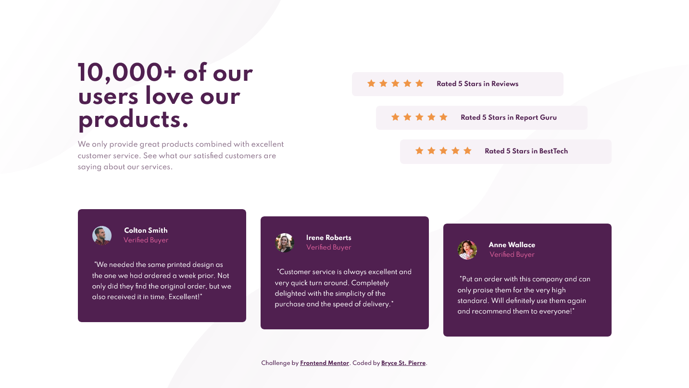

# Frontend Mentor - Social proof section solution

This is a solution to the [Social proof section challenge on Frontend Mentor](https://www.frontendmentor.io/challenges/social-proof-section-6e0qTv_bA). Frontend Mentor challenges help you improve your coding skills by building realistic projects. 

## Table of contents

- [Overview](#overview)
  - [The challenge](#the-challenge)
  - [Screenshot](#screenshot)
  - [Links](#links)
- [My process](#my-process)
  - [Built with](#built-with)
  - [What I learned](#what-i-learned)
  - [Useful resources](#useful-resources)
- [Author](#author)

## Overview

### The challenge

Users should be able to:

- View the optimal layout for the section depending on their device's screen size

### Screenshot



### Links

- Solution URL: [GitHub](https://github.com/BryceStPierre/fm-social-proof-section)
- Live Site URL: [Netlify](https://bsp-social-proof-section.netlify.app)

## My process

### Built with

- Semantic HTML5 markup
- Sass
- BEM naming conventions
- Flexbox
- CSS Grid
- Mobile-first workflow

### What I learned

I practiced using SASS variables and learned to use the `&` operator to facilitate BEM naming conventions:

```scss
.summary {
  &__heading {
    margin: 0;
    color: $veryDarkMagenta;
    line-height: 1.1;
    font-size: 1.9rem;
  }

  &__text {
    margin: 22px 0 45px;
    color: $darkGrayMagenta;
    line-height: 1.65;
    font-size: 0.9rem;
  }
}
```

### Useful resources

- [BEM and SASS: A Perfect Match](https://andrew-barnes.medium.com/bem-and-sass-a-perfect-match-5e48d9bc3894) - This paved the way for how to use BEM naming conventions in tandem with SASS.

## Author

- Website - [Bryce St. Pierre](https://www.brycestpierre.com)
- Frontend Mentor - [@brycestpierre](https://www.frontendmentor.io/profile/brycestpierre)
- Twitter - [@BryceStPierre](https://www.twitter.com/brycestpierre)
